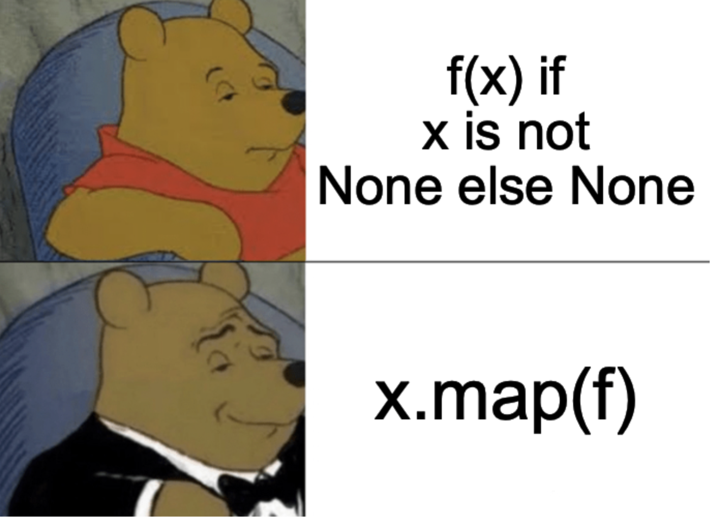

# pyfunds
Algebraic Data Structures for Python



This repository contains an implementation from scratch of simple algebraic data structures in Python. 

The following structures are implemented and tested:
 - Either
 - Option
 - Try

This library is inspired by Scala's implementation of these structures.

Feel free to open an issue or [send me an email](mailto:lucaruzzola@gmail.com) 
in case you'd like to contribute or if you see something that can be improved.

## Installation
This project is published on [PyPi](https://pypi.org/project/pyfunds/) as `pyfunds` so you can easily install it with `pip` as:
```shell
pip install pyfunds
```
or with `poetry` as:
```shell
poetry add pyfunds
```

## Setup

### Poetry
This project uses [poetry](https://github.com/python-poetry/poetry) to manage its dependencies.
Please refer to [poetry's official doc](https://python-poetry.org/docs/) for more info.


## Usage Examples

### Either

`Either` represents a value that can assume one of two types.

Concrete instances are of type `Left` or `Right`.

As an example, let's consider the case of making HTTP calls which might return a 
status code representing an error as the url is user-defined. 
If a call is successful, we want to return the JSON from the response, but if it's
not we'll map it to an internal error message.

The examples use this [example server](https://jsonplaceholder.typicode.com).

```python
import requests
from pyfunds.either import Left, Right, Either
from typing import Dict, Any

def map_response_to_msg(response: requests.models.Response):
    return f"The {response.request.method} request to {response.url} couldn't be completed " \
    f"and returned a {response.status_code} status_code"

def call_and_check(url: str) -> Either[str, Dict[Any, Any]]:
    response = requests.get(url)
    return Right(response.json()) if response.ok else Left(map_response_to_msg(response))
```

Users of this method will then be able to further chain operations which can result in 2 different results easily,
keeping track of the error message identifying the step that returned something unexpected in the chain.

```python
base_url = "https://jsonplaceholder.typicode.com"
users_json = call_and_check(f"{base_url}/users")
posts = users_json.flat_map(lambda json: call_and_check(f"{base_url}/posts?userId={json[0]['id']}"))
```

Lastly, we'll log the content of the `Either`at the appropriate level in each case; the contained string in the `Left` 
case at `warn`, or the `msg` field of the JSON dictionary in the `Right` case at `info`.

```python
from logging import getLogger

logger = getLogger()

posts.fold(logger.warning, lambda x: logger.info(x[0]["title"]))
```

The above example enters the `Right` branch of the `Either`, change the `base_url` to `$base_url/pizza` to get a `Left` at the first stage.

Please note that this is different from the case where an `Exception` is raised, which better fits the `Try` structure 
described below.

### Option

`Option` represents an optional value, its concrete instances are 
of type `Nothing` or `Some`.

As an example, let's consider the case of checking for a variable in a dictionary.
Normally, a default value of `None` is returned if the request key is not present in the dictionary,
however this requires the user of method returning such a value to check explicitly the content of the return variable.

Further, multiple calls of this type cannot be chained together, and the value needs to be checked every time.
Using `Option` we can instead reason using the type directly, and demanding to it the checking steps.

```python
from pyfunds.option import Option

d = {"food": "Pizza"}

result = Option.apply(d.get("another_key"))

awesomize = lambda x: x + "is awesome" 

msg = result.map(awesomize)
```

This way we didn't need to check whether the key was present in the dictionary or not.
Finally, we can get a default value to go from an `Option` to a `str`.

```python
msg.fold("Pizza is incredible anyways!", lamdba x: x + ", but fries are good too!")
```

The final `msg` will be `Pizza is incredible anyways!`.

If instead we had looked for the `food` key, `msg` would have been `Pizza is awesome, but fries are good too!`

### Try

`Try` represents a computation that can either fail (raising an Exception) or return the resulting value.

Concrete instances are of type `Failure` or `Success`.

As an example, let's see the case of a function that can raise an Exception:
``` python
import math

def unsafe_computation(value: int):
    return math.log(value)  # this throws an Exception if value is <= 0
```

Upon calling this function with `value` <= 0 we'll see:

```python
unsafe_computation(0)
```
```shell
Traceback (most recent call last):
  File "<stdin>", line 1, in <module>
ValueError: math domain error
```

To make this computation safe, even for `value` <= 0, we'll wrap its execution with Try:
```python
from pyfunds.try_ import Try

safe_result = Try.apply(unsafe_computation, 0)
```

`safe_result` will be of type `Failure`, containing the Exception.
In case it was called on proper input:
```python
safe_result = Try.apply(unsafe_computation, 1)
```

`safe_result` will be of type Success and it will contain the proper result.

Please notice that you need to pass the function and any function arguments, named and not, as arguments to 
`Try.apply()` rather than passing `f(args)`.

Alternatively, you can use this syntax:
```python
safe_result = Try.apply(lambda: unsafe_computation(0))
```

Using `Try`, an appropriate return type can be used for methods that might fail and raise an `Exeception`, 
leaving the user in charge of easily dealing with the subsequent behavior, for example:

```python
Try.apply(unsafe_computation, 1).map(lambda x: x + 1)
```